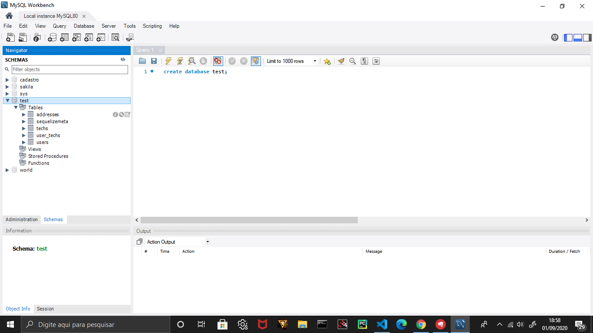

# SQL in NodeJs :computer:

# Este projeto é resultado de estudos com foco na implementação de Bancos de Dados (MySQL) em Nodejs. Este projeto reproduz um backend que armazena o nome do usuário, email e outras características e o coloca no banco de dados, além de fazer relações entre tabelas e aplicar filtros para uma pesquisa.

# MySQL Workbench foi utilizado para ver os resultados do backend e o insomnia para reproduzir as requisições.

;
